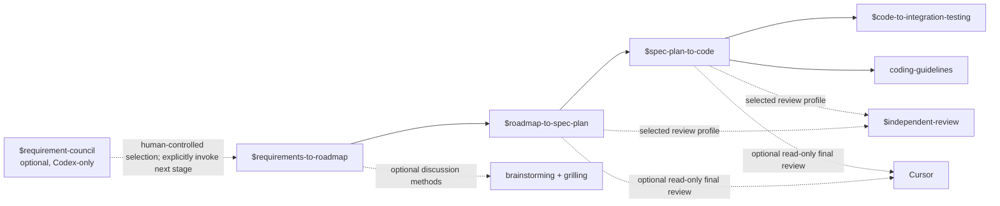

# AI-Native Coding Skills

A small, cross-runtime skill set for moving from a bounded requirement to verified code without turning agents into framework generators. It supports Claude Code, Codex, and an optional read-only Cursor review step.

English | [简体中文](./README.zh.md)

## Start here

Use the AI-native workflow only when you explicitly want its full decision and review trail:



`requirement-council` is an optional, Codex-only pre-workflow stage for non-empty feature-requirement text, from a vague sentence to a multi-line draft. Its three evidence-backed roles examine user value, minimum delivery/reframing, and concrete risk. It stops before roadmap, specification, planning, or implementation; the human controls whether to use its result and must explicitly invoke `$requirements-to-roadmap` afterward.

The three existing workflow skills are explicit-only and unchanged. They do not start each other automatically: finish and confirm one handoff before invoking the next.

## Skills and dependencies

| Skill | Use it for | Dependencies and handoff |
|---|---|---|
| [git-commit-convention](./skills/git-commit-convention/) | Keeping a local commit scoped, documented, and in the required Chinese commit format. | Independent. Requires a Git repository and an issue identifier for a commit. |
| [coding-guidelines](./skills/coding-guidelines/) | Writing or reviewing code without speculative abstractions, scope creep, unsafe boundaries, or half-finished migrations. | Baseline for implementation and review. **Required** by `spec-plan-to-code`. |
| [independent-review](./skills/independent-review/) | Shared evidence, scope, finding, and re-review standard for design, implementation, and concurrency profiles. | The caller selects the profile, `subagent` or `cursor` backend, model, and effort. It never makes those routing decisions. |
| [requirement-council](./skills/requirement-council/) | Exploring feature-requirement text with three roles and presenting evidence-backed directions, risks, and missing facts. | **Optional, Codex-only** pre-workflow stage. It does not start or hand off automatically to the existing workflow; after a human selection, explicitly invoke `$requirements-to-roadmap` if desired. |
| [requirements-to-roadmap](./skills/requirements-to-roadmap/) | Investigating a request, deciding scope, and producing a confirmed roadmap with `REQ-*`, `DEC-*`, `AC-*`, and Phase IDs. | Optional methods: `brainstorming` and `grilling`. It falls back to an equivalent in-skill method when either is unavailable. Its confirmed Phase ID is the input to `roadmap-to-spec-plan`. |
| [roadmap-to-spec-plan](./skills/roadmap-to-spec-plan/) | Turning one confirmed roadmap phase into a Decision Package, Spec, executable Plan, acceptance matrix, Integration Test Design, and review ledger. | **Requires** a confirmed roadmap/Phase ID. Its approved artifacts, including test semantics and real-environment test points, are the input to `spec-plan-to-code`. |
| [spec-plan-to-code](./skills/spec-plan-to-code/) | Implementing an approved Decision Package, Spec, Plan, and Integration Test Design with unit/contract validation and independent reviews. | **Requires** approved artifacts from `roadmap-to-spec-plan` and `coding-guidelines`. It hands implementation evidence to the explicit integration-testing workflow. |
| [code-to-integration-testing](./skills/code-to-integration-testing/) | Expanding an approved Integration Test Design into cases, executing probes and real-environment checks, and reporting integration evidence. | **Requires** a completed implementation and approved Integration Test Design. It does not alter product code or acceptance semantics; defects return to `spec-plan-to-code` for repair. |

Dependency terms:

- **Requires**: do not begin without the listed input or skill.
- **Conditionally invoked**: use only when its trigger is present.
- **Optional**: improves coverage or interaction quality but has a stated fallback.

## Runtime requirements

| Runtime or capability | Needed for |
|---|---|
| [Claude Code](https://claude.ai/code) with plugin support | Installing this repository as a Claude Code plugin. |
| [Codex](https://openai.com/codex/) | Installing or linking selected directories into `~/.codex/skills/`. Explicit-only workflow metadata is included. |
| [Cursor](https://cursor.com/) plus a Python environment where `cursor_sdk` is available | Optional external read-only review in `roadmap-to-spec-plan` and `spec-plan-to-code`. Not needed for the normal workflow. |
| Cursor API key at `~/.cursor-review/API_KEY` | Only when invoking the supplied Cursor review scripts. Keep the key out of repositories and prompts. |
| `brainstorming` and `grilling` skills | Optional, recommended for richer requirement discussion. `requirements-to-roadmap` degrades safely when they are absent. |
| Configured reviewer models | The workflow references Astra and other independent-review models. Make equivalent authorized reviewer capacity available in the host runtime. |
| Requirement Council (Codex only) | Requires three custom Agent TOMLs installed globally. At each run, the moderator selects one offered model/effort profile and passes it at child creation; read-only behavior is protocol-constrained unless the host attests enforcement. |

Requirement Council defaults to a standard before/after repository snapshot and can use an audited mode on request. Where the host cannot attest read-only enforcement, results are protocol-constrained rather than treated as a failed discussion; a detected repository change ends the run.

## Install

### Claude Code

```text
/plugins add-marketplace github:xfni/skills
/plugins install nixiaofeng-skills@nixiaofeng-skills
```

### Codex

The repository exposes the shared `skills/` directory through `.codex-plugin/plugin.json`. Until a marketplace entry is available, clone this repository and copy or link the skills you want into `~/.codex/skills/`.

```bash
ln -s "$(pwd)/skills/requirements-to-roadmap" ~/.codex/skills/requirements-to-roadmap
```

Repeat for each desired skill. Keep the workflow skills explicit-only; invoke them by name, for example `$requirements-to-roadmap`.

#### Requirement Council (personal Codex installation)

Requirement Council uses personal Codex Agents rather than project-scoped Agents. Complete both installation steps:

1. Copy or link `skills/requirement-council` to `~/.codex/skills/requirement-council`.
2. Copy all three standalone Agent TOMLs from `skills/requirement-council/agents/` to `~/.codex/agents/`:
   - `requirement-council-user-value-explorer.toml`
   - `requirement-council-minimal-delivery-reframer.toml`
   - `requirement-council-risk-counterexample-critic.toml`

For example, from the repository root:

```bash
mkdir -p ~/.codex/skills ~/.codex/agents
ln -s "$(pwd)/skills/requirement-council" ~/.codex/skills/requirement-council
cp skills/requirement-council/agents/requirement-council-user-value-explorer.toml ~/.codex/agents/requirement-council-user-value-explorer.toml
cp skills/requirement-council/agents/requirement-council-minimal-delivery-reframer.toml ~/.codex/agents/requirement-council-minimal-delivery-reframer.toml
cp skills/requirement-council/agents/requirement-council-risk-counterexample-critic.toml ~/.codex/agents/requirement-council-risk-counterexample-critic.toml
```

Start a fresh Codex session after installing or updating the Agent TOMLs so personal-Agent discovery reloads them.

Invoke it explicitly with non-empty requirement text. The text may span one or more lines; no issue identifier is required:

```text
$requirement-council
Support agents need to save common filter combinations and reopen them later.
The initial idea is a personal saved-filter list; team sharing is not yet decided.
Existing permissions must continue to control which records are visible.
```

This Skill is intentionally absent from the Claude Code plugin. The four Agents are not installed globally through `.codex-plugin/plugin.json`; install them through the two personal Codex steps above. A council run never automatically invokes or hands off to another Skill.

### Cursor review setup (optional)

The two workflow skills include a bounded, read-only `cursor_review.py`. Configure Cursor and the `cursor_sdk` bridge, generate an API key in Cursor, then save only that key in `~/.cursor-review/API_KEY`. The scripts default to `grok-4.6` with `high` effort and never grant Cursor write or shell tools.

## License

MIT
