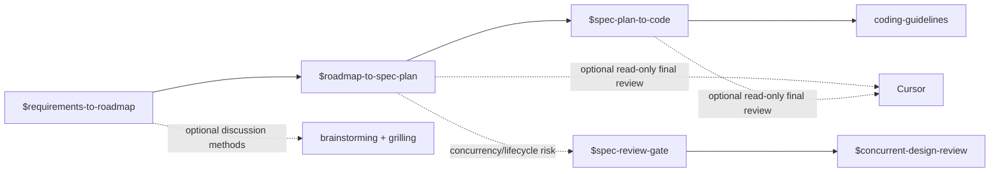

# AI-Native Coding Skills

A small, cross-runtime skill set for moving from a bounded requirement to verified code without turning agents into framework generators. It supports Claude Code, Codex, and an optional read-only Cursor review step.

English | [简体中文](./README.zh.md)

## Start here

Use the AI-native workflow only when you explicitly want its full decision and review trail:



The three workflow skills are explicit-only. They do not start each other automatically: finish and confirm one handoff before invoking the next.

## Skills and dependencies

| Skill | Use it for | Dependencies and handoff |
|---|---|---|
| [git-commit-convention](./skills/git-commit-convention/) | Keeping a local commit scoped, documented, and in the required Chinese commit format. | Independent. Requires a Git repository and an issue identifier for a commit. |
| [coding-guidelines](./skills/coding-guidelines/) | Writing or reviewing code without speculative abstractions, scope creep, unsafe boundaries, or half-finished migrations. | Baseline for implementation and review. **Required** by `spec-plan-to-code`. |
| [concurrent-design-review](./skills/concurrent-design-review/) | Independent design review of concurrency, locks, lifecycle, or shared mutable state. | **Conditionally invoked** by `spec-review-gate`; do not pre-assign competing reviewers. |
| [requirements-to-roadmap](./skills/requirements-to-roadmap/) | Investigating a request, deciding scope, and producing a confirmed roadmap with `REQ-*`, `DEC-*`, `AC-*`, and Phase IDs. | Optional methods: `brainstorming` and `grilling`. It falls back to an equivalent in-skill method when either is unavailable. Its confirmed Phase ID is the input to `roadmap-to-spec-plan`. |
| [roadmap-to-spec-plan](./skills/roadmap-to-spec-plan/) | Turning one confirmed roadmap phase into a Decision Package, Spec, executable Plan, acceptance matrix, and review ledger. | **Requires** a confirmed roadmap/Phase ID. Use `spec-review-gate` before Plan creation when concurrency or lifecycle risk is present. Uses Astra, then optionally Cursor, for independent final review. Its approved artifacts are the input to `spec-plan-to-code`. |
| [spec-review-gate](./skills/spec-review-gate/) | Deciding whether a Spec has concurrency, lifecycle, shared-state, or related risk that needs a specialist gate. | **Requires** `concurrent-design-review` for red-risk cases. It is a gate, not a general design-review replacement. |
| [spec-plan-to-code](./skills/spec-plan-to-code/) | Implementing an approved Decision Package, Spec, and Plan with change-type-appropriate tests, independent reviews, probes, runtime checks, and evidence. | **Requires** approved artifacts from `roadmap-to-spec-plan` and `coding-guidelines`. May use Cursor as the final external read-only review after Astra. |

Dependency terms:

- **Requires**: do not begin without the listed input or skill.
- **Conditionally invoked**: use only when its trigger is present.
- **Optional**: improves coverage or interaction quality but has a stated fallback.

## Runtime requirements

| Runtime or capability | Needed for |
|---|---|
| [Claude Code](https://claude.ai/code) with plugin support | Installing this repository as a Claude Code plugin. |
| [Codex](https://openai.com/codex/) | Installing or linking selected directories into `~/.codex/skills/`. Explicit-only workflow metadata is included. |
| [Cursor](https://cursor.com/) plus a Python environment where `cursor_sdk` is available | Optional external read-only review in `roadmap-to-spec-plan` and `spec-plan-to-code`. Not needed for the normal workflow. |
| Cursor API key at `~/.cursor-review/API_KEY` | Only when invoking the supplied Cursor review scripts. Keep the key out of repositories and prompts. |
| `brainstorming` and `grilling` skills | Optional, recommended for richer requirement discussion. `requirements-to-roadmap` degrades safely when they are absent. |
| Configured reviewer models | The workflow references Astra and other independent-review models. Make equivalent authorized reviewer capacity available in the host runtime. |

## Install

### Claude Code

```text
/plugins add-marketplace github:xfni/skills
/plugins install nixiaofeng-skills@nixiaofeng-skills
```

### Codex

The repository exposes the shared `skills/` directory through `.codex-plugin/plugin.json`. Until a marketplace entry is available, clone this repository and copy or link the skills you want into `~/.codex/skills/`.

```bash
ln -s "$(pwd)/skills/requirements-to-roadmap" ~/.codex/skills/requirements-to-roadmap
```

Repeat for each desired skill. Keep the workflow skills explicit-only; invoke them by name, for example `$requirements-to-roadmap`.

### Cursor review setup (optional)

The two workflow skills include a bounded, read-only `cursor_review.py`. Configure Cursor and the `cursor_sdk` bridge, generate an API key in Cursor, then save only that key in `~/.cursor-review/API_KEY`. The scripts default to `grok-4.6` with `high` effort and never grant Cursor write or shell tools.

## License

MIT
