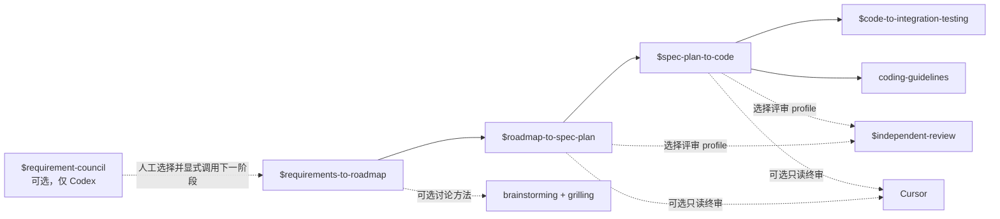

# AI-Native Coding Skills

一组小而明确、跨运行时复用的技能：将有边界的需求推进到可验证代码，同时避免 Agent 把简单改动写成框架。支持 Claude Code、Codex，以及可选的 Cursor 只读审阅。

[English](./README.md) | 简体中文

## 从这里开始

仅在你明确需要完整的决策、审阅与证据链时，显式调用 AI-native 工作流：



`requirement-council` 是面对非空功能需求文本的可选、仅 Codex 预工作流阶段；输入既可以是一句模糊需求，也可以是多行初稿。三个角色分别审视用户价值、最小交付/重构与具体风险，供人工选择。它在 roadmap、Spec、Plan 或实现之前结束；是否采用其结果由人工决定，之后如有需要，必须显式调用 `$requirements-to-roadmap`。

现有三个工作流技能保持不变，且均为仅显式调用：它们不会自动串联。一个阶段完成并由人工确认交接后，再调用下一个技能。

## 技能与依赖

| 技能 | 解决什么问题 | 依赖与交接 |
|---|---|---|
| [git-commit-convention](./skills/git-commit-convention/) | 让本地提交保持需求范围清晰、关联文档完整，并遵循中文提交信息格式。 | 独立使用。需要 Git 仓库；提交时需要 issue 编号。 |
| [coding-guidelines](./skills/coding-guidelines/) | 编码与审阅时避免推测性抽象、范围蔓延、不安全边界和半迁移。 | 实现与审阅的基线。`spec-plan-to-code` **必须依赖**。 |
| [independent-review](./skills/independent-review/) | 统一设计、实现和并发 profile 的证据、范围、发现与复审标准。 | 调用方选择 profile、`subagent` 或 `cursor`、模型与思考强度；本技能不做路由决定。 |
| [requirement-council](./skills/requirement-council/) | 用三个角色探讨功能需求，并给出有证据支持的方向、风险和待补事实。 | **可选，仅 Codex** 的预工作流阶段。它不会自动启动或交接给现有工作流；人工选择后，如有需要显式调用 `$requirements-to-roadmap`。 |
| [requirements-to-roadmap](./skills/requirements-to-roadmap/) | 定位现状、讨论范围并产出包含 `REQ-*`、`DEC-*`、`AC-*` 与 Phase ID 的确认 roadmap。 | 可选使用 `brainstorming` 与 `grilling`；缺失任一技能时使用内置等价方法。确认后的 Phase ID 交给 `roadmap-to-spec-plan`。 |
| [roadmap-to-spec-plan](./skills/roadmap-to-spec-plan/) | 将一个已确认 roadmap 阶段转为决策包、Spec、可执行 Plan、验收矩阵、集成测试设计和审阅台账。 | **必须依赖**确认后的 roadmap / Phase ID。已批准产物（含测试语义和真实环境测试点）交给 `spec-plan-to-code`。 |
| [spec-plan-to-code](./skills/spec-plan-to-code/) | 依据已批准决策包、Spec、Plan 和集成测试设计实现代码，并保留单元/契约验证与独立审阅。 | **必须依赖** `roadmap-to-spec-plan` 的批准产物和 `coding-guidelines`；将实现证据交接给显式集成测试工作流。 |
| [code-to-integration-testing](./skills/code-to-integration-testing/) | 将已批准集成测试设计展开为 case，执行探针与真实环境验证，并输出集成测试证据。 | **必须依赖**完成的实现和集成测试设计；不修改产品代码或验收语义，缺陷回到 `spec-plan-to-code` 修复。 |

依赖术语：

- **必须依赖**：没有前置产物或技能时不得开始。
- **按条件调用**：仅在触发条件成立时使用。
- **可选**：能提高讨论或覆盖质量，但技能已提供明确降级路径。

## 运行环境与外部能力

| 运行时或能力 | 用于 |
|---|---|
| [Claude Code](https://claude.ai/code)（支持 plugin） | 将本仓库安装为 Claude Code 插件。 |
| [Codex](https://openai.com/codex/) | 将选定技能安装或链接到 `~/.codex/skills/`。仓库提供仅显式调用的工作流元数据。 |
| [Cursor](https://cursor.com/) 与可导入 `cursor_sdk` 的 Python 环境 | `roadmap-to-spec-plan`、`spec-plan-to-code` 的可选外部只读审阅；正常工作流不依赖 Cursor。 |
| `~/.cursor-review/API_KEY` 中的 Cursor API key | 仅在调用仓库自带 Cursor 审阅脚本时需要。不得将 key 写入仓库或提示词。 |
| `brainstorming`、`grilling` 技能 | 推荐用于更深入的需求讨论；缺失时 `requirements-to-roadmap` 会安全降级。 |
| 已配置的审阅模型 | 工作流引用 Astra 等独立审阅模型；宿主运行时需要提供等价且已授权的审阅能力。 |
| Requirement Council（仅 Codex） | 需要将三个自定义 Agent TOML 全局安装到 Codex。每次运行由 moderator 选择模型/思考强度档位，并在创建子 Agent 时传入；未获宿主证明时，只读行为属于协议约束。 |

Requirement Council 默认仅在开始和结束时比较仓库快照；用户明确要求时才启用审计模式。宿主无法证明只读隔离时，结果标为协议约束而非直接失败；发现仓库变化即终止运行。

## 安装

### Claude Code

```text
/plugins add-marketplace github:xfni/skills
/plugins install nixiaofeng-skills@nixiaofeng-skills
```

### Codex

仓库通过 `.codex-plugin/plugin.json` 暴露共享的 `skills/` 目录。市场条目发布前，可 clone 本仓库，将所需技能复制或链接到 `~/.codex/skills/`：

```bash
ln -s "$(pwd)/skills/requirements-to-roadmap" ~/.codex/skills/requirements-to-roadmap
```

对其他所需技能重复操作。工作流技能保持仅显式调用，例如 `$requirements-to-roadmap`。

#### Requirement Council（个人 Codex 安装）

Requirement Council 使用个人 Codex Agent，而不是项目级 Agent。必须完成以下两个安装步骤：

1. 将 `skills/requirement-council` 复制或链接到 `~/.codex/skills/requirement-council`。
2. 将 `skills/requirement-council/agents/` 中全部三个独立 Agent TOML 复制到 `~/.codex/agents/`：
   - `requirement-council-user-value-explorer.toml`
   - `requirement-council-minimal-delivery-reframer.toml`
   - `requirement-council-risk-counterexample-critic.toml`

例如，在仓库根目录执行：

```bash
mkdir -p ~/.codex/skills ~/.codex/agents
ln -s "$(pwd)/skills/requirement-council" ~/.codex/skills/requirement-council
cp skills/requirement-council/agents/requirement-council-user-value-explorer.toml ~/.codex/agents/requirement-council-user-value-explorer.toml
cp skills/requirement-council/agents/requirement-council-minimal-delivery-reframer.toml ~/.codex/agents/requirement-council-minimal-delivery-reframer.toml
cp skills/requirement-council/agents/requirement-council-risk-counterexample-critic.toml ~/.codex/agents/requirement-council-risk-counterexample-critic.toml
```

安装或更新 Agent TOML 后，请启动一个全新的 Codex 会话，让个人 Agent 发现机制重新加载这些文件。

请使用非空需求文本显式调用。文本可以是一行或多行，不需要 issue 编号：

```text
$requirement-council
客服人员需要保存常用筛选条件，并在之后快速重新打开。
初步设想是个人筛选列表；是否支持团队共享尚未确定。
现有权限必须继续控制用户能够看到哪些记录。
```

此 Skill 有意不包含在 Claude Code plugin 中。四个 Agent 不会通过 `.codex-plugin/plugin.json` 全局安装；请按以上两个个人 Codex 步骤安装。Council 运行绝不会自动调用或交接给其他 Skill。

### Cursor 审阅配置（可选）

两个工作流技能内置受限、只读的 `cursor_review.py`。配置 Cursor 与 `cursor_sdk` bridge，在 Cursor 中生成 API key，并仅将 key 保存到 `~/.cursor-review/API_KEY`。脚本默认使用 `grok-4.6` 和 `high` 思考强度，且不会给 Cursor 写文件或 shell 权限。

## 开源协议

MIT
