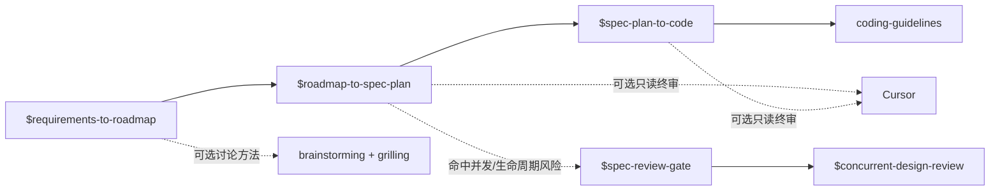

# AI-Native Coding Skills

一组小而明确、跨运行时复用的技能：将有边界的需求推进到可验证代码，同时避免 Agent 把简单改动写成框架。支持 Claude Code、Codex，以及可选的 Cursor 只读审阅。

[English](./README.md) | 简体中文

## 从这里开始

仅在你明确需要完整的决策、审阅与证据链时，显式调用 AI-native 工作流：



三个工作流技能均为仅显式调用：它们不会自动串联。一个阶段完成并由人工确认交接后，再调用下一个技能。

## 技能与依赖

| 技能 | 解决什么问题 | 依赖与交接 |
|---|---|---|
| [git-commit-convention](./skills/git-commit-convention/) | 让本地提交保持需求范围清晰、关联文档完整，并遵循中文提交信息格式。 | 独立使用。需要 Git 仓库；提交时需要 issue 编号。 |
| [coding-guidelines](./skills/coding-guidelines/) | 编码与审阅时避免推测性抽象、范围蔓延、不安全边界和半迁移。 | 实现与审阅的基线。`spec-plan-to-code` **必须依赖**。 |
| [concurrent-design-review](./skills/concurrent-design-review/) | 对并发、锁、生命周期和共享可变状态做独立设计审阅。 | 由 `spec-review-gate` **按条件调用**；调用方不得预先派发竞争性 reviewer。 |
| [requirements-to-roadmap](./skills/requirements-to-roadmap/) | 定位现状、讨论范围并产出包含 `REQ-*`、`DEC-*`、`AC-*` 与 Phase ID 的确认 roadmap。 | 可选使用 `brainstorming` 与 `grilling`；缺失任一技能时使用内置等价方法。确认后的 Phase ID 交给 `roadmap-to-spec-plan`。 |
| [roadmap-to-spec-plan](./skills/roadmap-to-spec-plan/) | 将一个已确认 roadmap 阶段转为决策包、Spec、可执行 Plan、验收矩阵和审阅台账。 | **必须依赖**确认后的 roadmap / Phase ID。存在并发或生命周期风险时，在写 Plan 前使用 `spec-review-gate`。终审顺序是 Astra，之后可选 Cursor。已批准产物交给 `spec-plan-to-code`。 |
| [spec-review-gate](./skills/spec-review-gate/) | 判断 Spec 是否包含并发、生命周期、共享状态等需要专项门禁的风险。 | 红色风险时**必须依赖** `concurrent-design-review`。它是专项门禁，不替代一般设计审阅。 |
| [spec-plan-to-code](./skills/spec-plan-to-code/) | 依据已批准决策包、Spec 和 Plan 实现代码，并保留按变更类型选择的测试、独立审阅、探针、运行时验证与证据。 | **必须依赖** `roadmap-to-spec-plan` 的批准产物和 `coding-guidelines`。Astra 终审后可选 Cursor 作为最后的外部只读审阅。 |

依赖术语：

- **必须依赖**：没有前置产物或技能时不得开始。
- **按条件调用**：仅在触发条件成立时使用。
- **可选**：能提高讨论或覆盖质量，但技能已提供明确降级路径。

## 运行环境与外部能力

| 运行时或能力 | 用于 |
|---|---|
| [Claude Code](https://claude.ai/code)（支持 plugin） | 将本仓库安装为 Claude Code 插件。 |
| [Codex](https://openai.com/codex/) | 将选定技能安装或链接到 `~/.codex/skills/`。仓库提供仅显式调用的工作流元数据。 |
| [Cursor](https://cursor.com/) 与可导入 `cursor_sdk` 的 Python 环境 | `roadmap-to-spec-plan`、`spec-plan-to-code` 的可选外部只读审阅；正常工作流不依赖 Cursor。 |
| `~/.cursor-review/API_KEY` 中的 Cursor API key | 仅在调用仓库自带 Cursor 审阅脚本时需要。不得将 key 写入仓库或提示词。 |
| `brainstorming`、`grilling` 技能 | 推荐用于更深入的需求讨论；缺失时 `requirements-to-roadmap` 会安全降级。 |
| 已配置的审阅模型 | 工作流引用 Astra 等独立审阅模型；宿主运行时需要提供等价且已授权的审阅能力。 |

## 安装

### Claude Code

```text
/plugins add-marketplace github:xfni/skills
/plugins install nixiaofeng-skills@nixiaofeng-skills
```

### Codex

仓库通过 `.codex-plugin/plugin.json` 暴露共享的 `skills/` 目录。市场条目发布前，可 clone 本仓库，将所需技能复制或链接到 `~/.codex/skills/`：

```bash
ln -s "$(pwd)/skills/requirements-to-roadmap" ~/.codex/skills/requirements-to-roadmap
```

对其他所需技能重复操作。工作流技能保持仅显式调用，例如 `$requirements-to-roadmap`。

### Cursor 审阅配置（可选）

两个工作流技能内置受限、只读的 `cursor_review.py`。配置 Cursor 与 `cursor_sdk` bridge，在 Cursor 中生成 API key，并仅将 key 保存到 `~/.cursor-review/API_KEY`。脚本默认使用 `grok-4.6` 和 `high` 思考强度，且不会给 Cursor 写文件或 shell 权限。

## 开源协议

MIT
